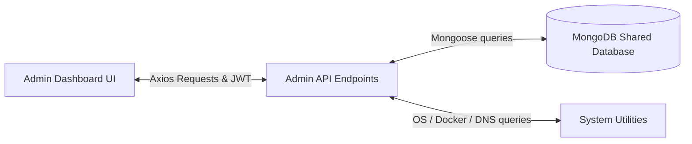

# 🏛️ Rushes Admin Portal Architecture & Directory Guide

The **Rushes Admin Portal** is a secure, decoupled administration console built to run on an isolated server or port. It provides real-time system monitoring, content moderation, user management, and curations control.

---

## 🏗️ Isolated Architecture & Security

*   **Decoupled Design**: The portal operates completely independently of the main Rushes frontend, communicating directly with the MongoDB database cluster.
*   **Security Gatekeeping**: Admin endpoints are protected by `requireAdmin` middleware. Access is strictly limited to authenticated users with the `role: 'admin'` attribute in their database profile.
*   **Token-Based JWT Auth**: Session credentials are encrypted into a custom JWT token and stored in HTTP-Only secure cookies, keeping administrative tokens isolated from standard user cookies.

---

## 📂 Directory Layout

The admin portal follows a Next.js Pages routing structure:

```text
rushes-admin/
├── components/          # Dashboard visual components (Tremor, charts, modals)
├── lib/                 # Core libraries (Mongoose db connection, JWT admin validators)
├── models/              # Admin Mongoose Schemas (AuditLog, CuratedRec, User, Report, Feedback)
├── pages/               # UI page routes & API endpoints
│   ├── api/             # REST APIs supporting admin panel functions
│   │   ├── auth/        # Login, logout, and token session verification (me.js)
│   │   ├── feedback/    # Listing and deleting user feedback
│   │   ├── recommendations/ # Managing curated recommendation logs
│   │   ├── reports/     # Listing and resolving abuse/content reports
│   │   ├── system/      # Health check queries (RAM, ROM check, Docker status, DNS info)
│   │   └── users/       # Listing and investigating specific user profiles/actions
│   ├── dashboard/       # Secured Admin Dashboard pages
│   │   ├── audit/       # View administrative actions history (Audit logs)
│   │   ├── backup/      # Database backup dashboard (trigger backups/restore operations)
│   │   ├── curations/   # Edit and promote featured movies or TV shows
│   │   ├── feedback/    # List and manage user feedbacks
│   │   ├── monitoring/  # Real-time server load, disk space, and Docker logs
│   │   ├── reports/     # Content moderation queue (posts, takes, comments)
│   │   ├── security/    # System settings, secret keys, API parameters
│   │   └── users/       # User profiles, bans, suspensions, and detail investigation
│   └── index.js         # Admin portal login landing screen
├── public/              # Global media, icons, and fonts (GeistVF)
├── scripts/             # Administrative CLI scripts (seed-admin.js)
├── store/               # Redux state management slices for admin sessions
└── styles/              # Global CSS & Tailwind variables
```

---

## 🔗 How They Work Together



1.  **Administrative Actions**: When an admin suspends a user or deletes an abusive post:
    *   The Admin UI dispatches a `POST` request to `/api/users/[id]/action` or `/api/reports`.
    *   The endpoint validates the admin's session via `requireAdmin`.
    *   It executes the update in MongoDB and automatically creates a log entry in the `AuditLog` collection.
2.  **System Monitoring (`/api/system/health`)**:
    *   Fetches dynamic server load metrics (RAM usage, free disk ROM space on drive `C:\` or `/` mount, system uptime, and core count).
    *   Interacts with the local Docker daemon CLI (`docker ps`) to query active container statuses.
    *   Performs nameservers and DNS resolutions for `moviefinderforyou.com` using the local DNS resolver.
    *   Computes simulated API requests, response latency, and error rates.
3.  **Content Moderation Queue**:
    *   The admin reviews items flagged by users (hate speech, spam, piracy).
    *   Resolving a report deletes the offensive post or dismisses the flag, syncing changes across the Rushes ecosystem.
