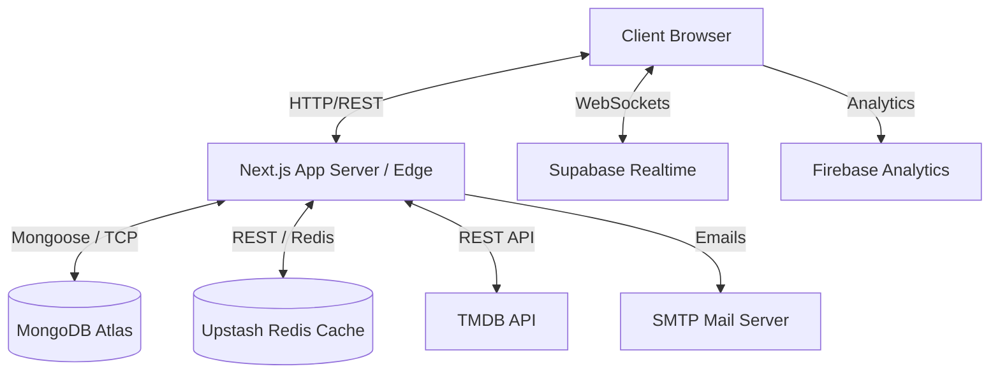

# MovieFinderForYOU — System Architecture

This document provides a detailed overview of the system architecture for **MovieFinderForYOU**, including the newly integrated features such as real-time messaging, social feeds, recommendation decision engines, and caching strategies.

## 1. High-Level System Architecture

The application follows a modern decoupled monolith architecture utilizing Next.js as the core framework, separating the frontend UI from backend API routes while keeping them in the same repository.

## 2. Core Components & Tech Stack

- **Frontend**: React 18, Next.js 14 (Pages Router), Tailwind CSS, Framer Motion, Lenis (Smooth Scrolling).
- **Backend**: Node.js (Next.js Serverless API Routes).
- **Database**: MongoDB Atlas (Primary Datastore), Mongoose (ODM).
- **Caching**: Upstash Redis (Serverless Redis for API response caching & rate limiting).
- **Real-Time / Social**: Supabase (WebSockets for chat and live notifications).
- **Analytics & Error Tracking**: Firebase (Client-side events), Sentry (Error logging & performance monitoring).
- **Authentication**: NextAuth.js / Custom JWT with HTTP-Only cookies, bcrypt.
- **Infrastructure**: Docker, Nginx, Docker-Compose (for local/self-hosted environments).

---

## 3. Detailed Data Flows

### A. Authentication Flow
We use a robust JWT-based authentication system backed by HTTP-Only cookies to prevent XSS attacks.

1. **Login Request**: User submits credentials to `/api/auth/login`.
2. **Validation**: Zod validates the payload. Rate limiting (Redis) prevents brute-force attacks.
3. **Verification**: `authService` finds the user in MongoDB and verifies the password via `bcrypt`.
4. **Token Generation**: A JWT is signed and set as an HTTP-Only, Secure, SameSite=Strict cookie.
5. **Session Hydration**: Redux stores the user payload and fetches user-specific data (watchlist, preferences).

### B. Real-Time Chat & Messaging (Supabase)
To support the new messaging system, we offload WebSocket connections to Supabase.

1. **Message Creation**: User sends a message via UI. The client makes a `POST /api/messages/[id]` request.
2. **Persistence**: Next.js API route validates and saves the message to MongoDB (`Message` model).
3. **Real-Time Broadcast**: The Next.js backend (or client) triggers a Supabase broadcast event on the specific conversation channel.
4. **Client Reception**: The recipient's browser, subscribed to the Supabase channel, receives the payload and updates the Redux store instantly.

### C. Recommendation Decision Engine
The `lib/decisionEngine.js` powers the tailored movie and TV show recommendations.

1. **Input**: User's preferred genres, watch history, and saved items.
2. **Processing**: The engine fetches candidate items from TMDB and the internal database.
3. **Scoring**: Items are scored based on recency, rating, and user genre overlap.
4. **Caching**: Results are cached in Upstash Redis for 1-4 hours to reduce TMDB API calls and improve load times.

---

## 4. Database Schema Structure (MongoDB)

Our MongoDB database consists of several interconnected collections:

- **Users**: Core user profiles, authentication data, role (admin/user), and settings.
- **Takes / Posts**: User-generated social content (reviews, hot takes, lists).
- **Comments**: Replies to posts and takes.
- **Conversations & Messages**: Peer-to-peer chat logs.
- **Notifications**: In-app alerts for likes, follows, and system broadcasts.
- **Reports**: Moderation queue for user-flagged content.

---

## 5. Caching Strategy (Upstash Redis)

To ensure the application scales seamlessly, Upstash Redis is implemented across high-traffic endpoints:

- **TMDB API Proxy**: Responses from TMDB (like trending rows and genre lists) are cached for 15-30 minutes.
- **Rate Limiting**: IP-based rate limiting on sensitive routes (auth, password reset, messaging) using sliding window algorithms.
- **Daily Picks**: Cron jobs (`/api/jobs/daily-picks`) pre-compute and store daily recommendations in Redis.

---

## 6. Infrastructure & Docker Deployment

The application is containerized using a multi-stage `Dockerfile` optimized for Next.js.

- **Stage 1 (deps)**: Installs dependencies using `npm ci --legacy-peer-deps`.
- **Stage 2 (builder)**: Builds the Next.js application, outputting a highly optimized `.next/standalone` directory.
- **Stage 3 (runner)**: A minimal Node.js Alpine image that runs the compiled server, exposing port 3000.

`docker-compose.yml` orchestrates the App container, a local MongoDB instance (for development), and an Nginx reverse proxy for SSL termination and static asset caching.
