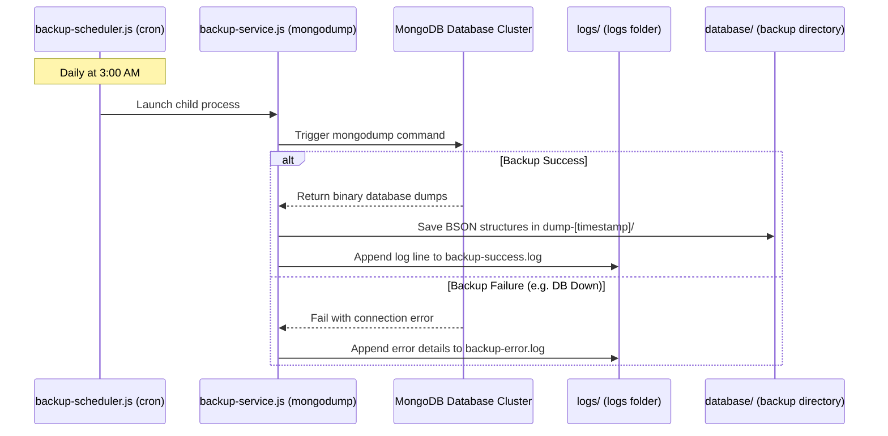

# 💾 Database Backup & Disaster Recovery Pipeline

The Rushes ecosystem features an automated, Node.js-powered database backup, scheduling, logging, and restoration pipeline designed to ensure data integrity and facilitate quick recovery.

---

## 🏗️ Backup Workflow



---

## 🛠️ Architectural Components

The pipeline is split into simple scripts located in the `/scripts` directory of the application:

### 1. Automated Scheduler (`backup-scheduler.js`)
*   **Path**: `/scripts/backup-scheduler.js`
*   **Daemon Role**: Runs as a background service waiting to trigger backups.
*   **Engine**: Uses `node-cron` to schedule events.
*   **Default Cron**: Runs **daily at 3:00 AM** (`0 3 * * *`).
*   **Operation**: Spawns `node scripts/backup-service.js` as a child process and handles execution errors.

### 2. Backup Service (`backup-service.js`)
*   **Path**: `/scripts/backup-service.js`
*   **Execution Role**: Connects to the database and dumps its contents.
*   **How it works**:
    1.  Reads the connection string (`MONGODB_URI`) from configuration.
    2.  Generates a timestamped subfolder path inside `database/` (e.g., `dump-2026-06-04T12-30-00-000Z`).
    3.  Runs the native `mongodump` binary, outputting all database collections as raw BSON data and JSON schema definitions.
    4.  Captures execution exit codes:
        *   **On Success**: Appends confirmation data to `logs/backup-success.log`.
        *   **On Failure**: Captures the process error output and writes the trace details to `logs/backup-error.log`.

### 3. Restoration Utility (`restore-system.js`)
*   **Path**: `/scripts/restore-system.js`
*   **Recovery Role**: Restores database state from a backup folder.
*   **How it works**: Spawns the native `mongorestore` binary pointing to the designated backup folder passed via arguments.

### 4. Admin Seeding & Fix Tools
*   `fix-account.js`: Lets administrators quickly verify or delete user accounts via CLI.
*   `seed-admin.js`: Seeds initial superuser/admin credentials into the database.

---

## 📂 Output Directories & Files

All backup tasks output data to target folders located in the root of the workspace directory:
*   `database/dump-[timestamp]/`: Subdirectory containing BSON archives and collection schema JSON configs.
*   `logs/backup-success.log`: Diagnostic logs confirming timestamped success events.
*   `logs/backup-error.log`: Diagnostic logs showing stack traces of failed operations (e.g., connection timed out or missing binaries).

---

## 🚀 Execution & CLI Commands

### Start the Backup Daemon:
```bash
# Keeps running in the background, triggering at 3:00 AM daily
node scripts/backup-scheduler.js
```

### Run a Manual Backup immediately:
```bash
# Instantly runs mongodump and writes to logs
node scripts/backup-service.js
```

### Restore Database from a Dump:
```bash
# Syntax: node scripts/restore-system.js <dump-folder-name>
node scripts/restore-system.js dump-2026-06-04T12-30-00-000Z
```

### Seed initial Admin Account:
```bash
node scripts/seed-admin.js
```
