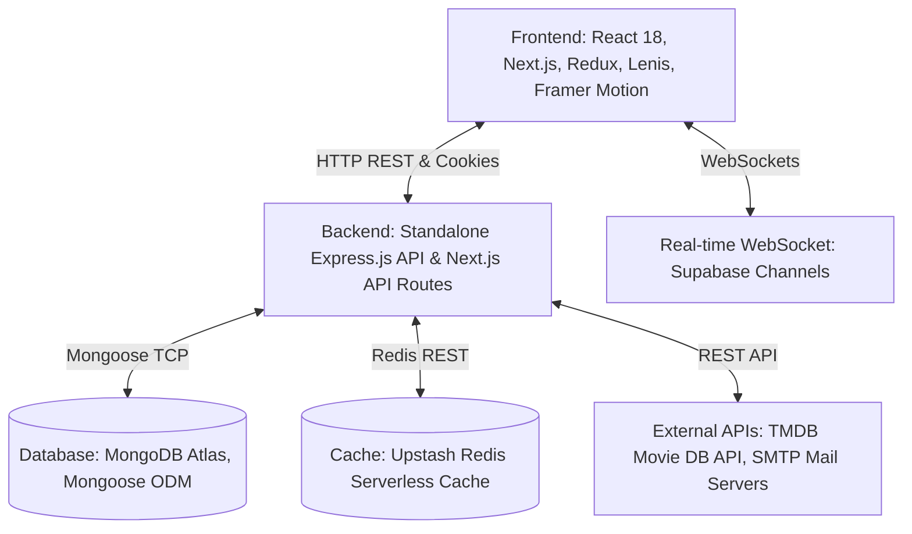

# 🎬 Rushes (MovieFinder) Ecosystem Overview

**Rushes** (formerly known as MovieFinder) is a modern, full-stack application designed for cinematic discovery, personal media tracking, and social interaction. It acts as a comprehensive community platform for movie and TV series enthusiasts.

---

## 🚀 Core Features

*   **Cinematic Discovery**: Integrated with **The Movie Database (TMDB) API** to query trending lists, movie details, reviews, trailers, and cast lists.
*   **Tailored Recommendation Engine**: Powered by a custom `decisionEngine.js` matching algorithm that computes movie recommendations based on user genre preferences, watch histories, and user interactions (likes/dislikes).
*   **Real-Time Social Interaction ("Takes")**: Users can write reviews, voice opinions, and discuss movies. It includes full social networking capabilities (comments, likes, shares, user follows, and user blocking).
*   **Real-Time Live Chat & Watch Rooms**: WebSockets powered by **Supabase Channels** facilitate peer-to-peer messaging and synced watch-together parties.
*   **OTT Routing & Analytics**: Routes users directly to original streaming platforms (e.g., Netflix, Prime Video, JioCinema, Hotstar) with affiliate links and outbound redirect tracking.
*   **Administration Control Portal**: Isolated dashboard panel to monitor system health, moderate reported content, ban abusive accounts, and configure curated recommendations.

---

## 🛠️ Technology Stack

### 1. Frontend Technologies
*   **React 18 & Next.js**: Standard rendering layer.
*   **Tailwind CSS**: Modern utility styling.
*   **Framer Motion & GSAP**: Fluid cinematic micro-animations and custom clapperboard page loaders.
*   **Lenis**: Smooth inertial scroll behaviors.
*   **Redux Toolkit**: Client-side state hydration, guest-mode local storage tracking, and active sessions.

### 2. Backend & Data Layer
*   **Node.js (Express & Serverless API Routes)**: Decoupled API endpoints.
*   **MongoDB Atlas & Mongoose**: Persistent datastore with schemas for posts, users, calls, conversations, and reports.
*   **Upstash Redis**: Serverless Redis cache used for TMDB API proxy queries, rate limiting, and daily recommendation lists.
*   **Supabase WebSockets**: Serverless event broadcasting client for messaging.
*   **Nodemailer**: Email processing, welcome letters, verification links, and OTP deliveries.

---

## 🔒 Security & Data Flow

### A. Authentication
We employ a robust, secure authentication flow:
1.  **User Credentials**: Password hashing via **bcryptjs** prevents raw password storage.
2.  **Tokens**: Node.js generates JSON Web Tokens (JWT) signed via local secrets.
3.  **HTTP-Only Cookies**: Tokens are injected directly into HTTP-Only, Secure, SameSite=Lax cookies to prevent XSS credential stealing.

### B. Safety & Moderation
1.  **BlockCheck Middleware**: Custom middleware restricts blocked users from viewing, commenting, or messaging one another.
2.  **RateLimiter Middleware**: Prevents brute force login/registration attempts using IP-based sliding window rate-limiting in Redis.
3.  **Abuse Reporting Queue**: Users can report accounts or posts. The reports are pushed to a collection and reviewed inside the Admin Console.
