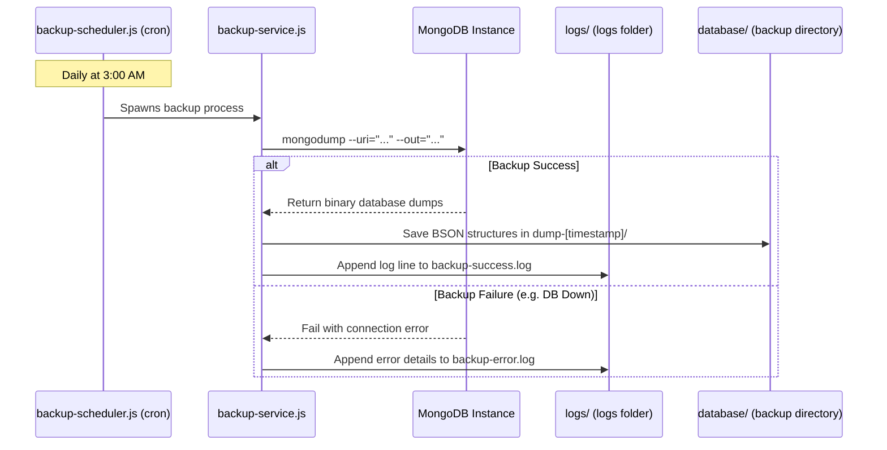

<p align="center">
  
</p>
<br/>


<br/><br/>

<!-- STACK BADGES -->


<br/>


<br/><br/>


</div>

---

## 🧠 What is This?

**MovieFinder** is a feature-rich, full-stack **Next.js 14** application designed for cinematic discovery, social interaction, and real-time community engagement. 

It has evolved far beyond a simple movie lookup tool into a complete social network for cinephiles. Next.js handles both the stunning React frontend and the powerful Node.js backend API routes.

For an in-depth breakdown of how the systems communicate, caching strategies, and database schemas, please review the breakdown below.

---

## 🏗️ Architecture & Directory Structure

Rushes is built as a robust Next.js monolith, structured for scalable future extraction into microservices.

<details>
<summary><b>📂 View Full Directory Tree</b></summary>
<br/>

```text
Rushes/
├── components/          # Reusable React UI Components
│   ├── admin/           # Admin Dashboard Visualizations
│   ├── chat/            # Real-time Messaging Components (WebSockets)
│   ├── search/          # Intelligent Search & Filters
│   ├── social/          # Social Feed, Takes, and Friend Activity
│   ├── ui/              # Base UI Elements (Buttons, Modals, Cards)
│   └── ...              # Core App Components (Navbar, MediaCards, HeroSlider)
├── lib/                 # Core Libraries & Integrations
│   ├── dbConnect.js     # MongoDB Connection Logic
│   ├── redis.js         # Upstash Redis Caching Engine
│   ├── supabase.js      # Supabase Realtime Client
│   ├── tmdb.js          # TMDB API Handlers & Formatters
│   └── decisionEngine.js# Algorithmic Recommendation Engine
├── middleware/          # Security & Validation Middleware
│   ├── requireAuth.js   # JWT & NextAuth Hybrid Authentication
│   └── validate.js      # Zod Schema Validation
├── models/              # Mongoose Database Schemas
│   ├── User.js          # Core User Profiles & Watchlists
│   ├── Take.js          # User Reviews & Social Posts
│   └── Notification.js  # Real-time User Alerts
├── pages/               # Next.js Pages (App Routing & API)
│   ├── api/             # Backend API Routes
│   │   ├── admin/       # Secured Admin API Endpoints
│   │   ├── auth/        # NextAuth & Custom JWT Endpoints
│   │   ├── media/       # TMDB Proxy & Formatting API
│   │   ├── user/        # Watchlist, History, Preferences API
│   │   └── takes/       # Social Feed API
│   ├── admin/           # Admin Portal UI Pages
│   ├── movies/          # SSR Movie Detail Pages
│   ├── series/          # SSR Series Detail Pages
│   ├── u/               # Public User Profiles
│   └── index.js         # Dynamic Home Feed
├── scripts/             # DevOps & Operations
│   ├── backup-scheduler.js # Automated Database Backups
│   └── backup-service.js   # BSON/GZ Compression Engine
├── services/            # Business Logic Abstraction Layer
│   └── authService.js   # Centralized Auth Logic
├── store/               # Redux Toolkit State Management
│   ├── slices/          # User, UI, Watchlist, Location Slices
│   └── index.js         # Redux Store Configuration
├── styles/              # Global Tailwind & Lenis CSS
└── utils/               # Helper Functions (Formatting, Math, Hooks)
```
</details>

### Architectural Highlights

1. **The Backend for Frontend (BFF):** Next.js `pages/api` acts as a secure proxy, hiding TMDB API keys and performing heavy server-side formatting before data reaches the client.
2. **Hybrid State Management:** Redux handles transient UI state and Guest `localStorage`, while MongoDB maintains persistent global state for authenticated users. 
3. **Real-Time Layer:** Supabase WebSockets handle instantaneous Chat and Watch Party synchronization completely independent of the Node.js API routes.
4. **Resilient Caching:** Upstash Redis sits in front of the TMDB API calls, ensuring high availability even if TMDB rate limits are hit.
---

## ✨ Features & Tech Stack

We utilize a wide array of modern technologies to deliver a premium user experience:

| Feature | Tech Used | Details |
|:---|:---|:---|
| **Social Feeds ("Takes")** | MongoDB, Next.js API | Post hot takes, reviews, follow users, and like posts. |
| **Real-Time Chat** | Supabase WebSockets | Peer-to-peer messaging and live notifications. |
| **Smart Recommendations** | Custom Decision Engine | Tailored suggestions based on watch history and onboarding preferences. |
| **High-Speed Caching** | Upstash Redis | API rate limiting and sub-millisecond response caching. |
| **Cinematic UI & Loader** | Framer Motion, Tailwind | Ken Burns effects, smooth scrolling (Lenis), dynamic carousels, and custom cinematic clapperboard loading animations. |
| **Global Trailers** | YouTube Embeds | Autoplaying HD trailers via a global floating modal. |
| **Robust Auth & OTP** | JWT, NextAuth, bcrypt | Secure email/password login with HTTP-only cookies, password resets, and 2-step OTP verification for password updates. |
| **Abuse Reporting** | MongoDB, Admin Dashboard | Ability to report Takes/Posts for Hate Speech, Nudity/Sexual Content, Piracy, Impersonation etc., and moderate them from the Admin Panel. |
| **OTT Affiliate Engine** | MongoDB, Analytics API | Monetize and route users to original OTT streaming platforms via partner referral URLs with outbound click analytics. |
| **Production Ready** | Docker, Nginx | Multi-stage Dockerfiles utilizing Next.js `standalone` mode. |
| **Analytics**| Firebase Analytics | Real-time user behavior tracking and client-side event monitoring. |

---

## 🏛️ Admin Portal Architecture

MovieFinder includes a highly secure, decoupled **Administration Console** (`rushes-admin`) built to run on a separate port or isolated server.
- **Tech Stack:** Next.js 14 (App Router), Tremor (Data Visualization), Tailwind CSS.
- **Authentication:** Isolated JWT-based auth via the decoupled `rushes-admin` panel, restricting access to users with administrative privileges.
- **Capabilities:** 
  - **Global Dashboard:** Real-time metrics on user signups, total Takes, lists, and engagement.
  - **Content Moderation:** Review user reports, delete abusive Takes, and manage community standards.
  - **User Management:** Suspend, ban, or unblock users globally across the platform.

---

## 💾 Automated Backup & Disaster Recovery System

The application features a complete, Node.js-powered database backup, scheduling, and disaster recovery framework located in the `/scripts` directory. This system ensures high availability and resilience against data corruption, hardware failures, or connection issues.



### 1. Architectural Components

#### ⏰ Automated Scheduler (`scripts/backup-scheduler.js`)
*   **Purpose**: Continually schedules and triggers database backups automatically in the background.
*   **How it works**: Uses `node-cron` to schedule backup events.
*   **Default Schedule**: Runs **daily at 3:00 AM** (`0 3 * * *`).
*   **Execution**: When triggered, it spawns `node scripts/backup-service.js` as a child process and handles execution errors.

#### ⚙️ Backup Service (`scripts/backup-service.js`)
*   **Purpose**: The execution engine that connects to MongoDB, extracts schemas/data, and compresses them.
*   **How it works**:
    1. Reads MongoDB credentials from environment variables (`MONGODB_URI`).
    2. Generates a timestamped backup directory (e.g., `C:\RUSHUES BACKUP\database\dump-2026-06-04T12-30-00-000Z`).
    3. Spawns the native `mongodump` utility, dumping all collections as BSON files into the database subdirectory.
    4. Evaluates exit codes:
        *   **On Success**: Appends a timestamped confirmation message to `/logs/backup-success.log`.
        *   **On Failure**: Catches stdout/stderr details and appends the trace to `/logs/backup-error.log`.

#### 🔄 Restoration Utility (`scripts/restore-system.js`)
*   **Purpose**: Disaster recovery tool to restore the database to a previous point in time.
*   **How it works**: Uses the native `mongorestore` tool to parse database BSON dumps and load them back into the active database instance.
*   **Usage**: Run the script and pass the folder name of the target backup directory as an argument.

#### 🔧 Account Helper (`scripts/fix-account.js`)
*   **Purpose**: CLI script for administrative user management (quick verification or deletion of test accounts).
*   **Usage**: Run `node scripts/fix-account.js <email> [verify|delete]`

---

### 2. Output File System Mapping
All backup actions output to dedicated folders located in the root of the workspace directory:
*   `database/dump-[timestamp]/`: Stores the raw BSON files and JSON metadata schemas for all collections.
*   `logs/backup-success.log`: Appends confirmation timestamps of successful backups.
*   `logs/backup-error.log`: Diagnostic logs containing stack traces if a backup fails (e.g., database connection timeout or missing `mongodump`).

---

### 3. Usage & CLI Commands

#### Start the Background Backup Daemon:
```bash
# Start scheduler (keeps running in the background)
node scripts/backup-scheduler.js
```

#### Trigger a Manual Backup immediately:
```bash
# Run the backup service manually
node scripts/backup-service.js
```

#### Restore the Database from a Snapshot:
```bash
# Syntax: node scripts/restore-system.js <dump-folder-name>
node scripts/restore-system.js dump-2026-06-04T12-30-00-000Z
```

#### Verify or Delete a User Account via CLI:
```bash
# Mark user as verified
node scripts/fix-account.js test@gmail.com verify

# Delete user account for clean re-registration
node scripts/fix-account.js test@gmail.com delete
```

---

---

## 🚀 Quick Start

<details>
<summary><b>🖥️ Local Development (Node.js)</b></summary>
<br/>

```bash
git clone https://github.com/core-ctrl/Rushes.git
cd Rushes
npm install --legacy-peer-deps
cp .env.example .env.local
# Fill in your keys in .env.local (See Environment Variables below)
npm run dev
```

Open → [http://localhost:3000](http://localhost:3000)

</details>

<details>
<summary><b>🐳 Docker Deployment (Recommended)</b></summary>
<br/>

Our Docker configuration uses Next.js `standalone` mode and injects `.env.local` directly into the build context for a seamless setup.

```bash
# Start the entire stack (App, MongoDB, Nginx)
docker-compose up --build -d

# View logs
docker-compose logs -f app

# Stop the stack
docker-compose down
```

</details>

<details>
<summary><b>⚙️ Environment Variables (.env.local)</b></summary>
<br/>

Create a `.env.local` file in the root directory. **Never commit this file.**

```env
# TMDB API
TMDB_API_KEY=your_tmdb_key

# Database & Caching
MONGODB_URI=mongodb://localhost:27017/moviefinder
UPSTASH_REDIS_REST_URL=your_upstash_url
UPSTASH_REDIS_REST_TOKEN=your_upstash_token

# Real-Time (Supabase)
NEXT_PUBLIC_SUPABASE_URL=your_supabase_url
NEXT_PUBLIC_SUPABASE_ANON_KEY=your_supabase_key

# Security & Auth
JWT_SECRET=your_jwt_secret
NEXTAUTH_SECRET=your_nextauth_secret
NEXTAUTH_URL=http://localhost:3000
NEXT_PUBLIC_APP_URL=http://localhost:3000

# Email (SMTP)
SMTP_HOST=smtp.gmail.com
SMTP_PORT=587
SMTP_USER=your_email
SMTP_PASS=your_app_password

# Analytics & Monitoring
NEXT_PUBLIC_FIREBASE_API_KEY=your_firebase_key
```

</details>

---

## 🗺️ Master Documentation Hub

For detailed guides on specific modules of the ecosystem, refer to these dedicated documents:

*   📖 **[PROJECT.md](./PROJECT.md)**: Overall **Rushes Ecosystem Blueprint** including project goals, technological stack, data streams, and database configurations.
*   💾 **[BACKUP.md](./BACKUP.md)**: Complete guide to the **Database Backup Pipeline**, cron scheduler configurations, manual backup triggers, and restore processes.
*   🛡️ **[ADMIN.md](./ADMIN.md)**: In-depth analysis of the **Admin Portal Architecture**, folder mappings, API endpoints, moderation interfaces, and system health monitors.

---

## 📜 License

This project is open-sourced software licensed under the **MIT License**. See the [LICENSE](LICENSE) file for more information.

> **Disclaimer**: This product uses the TMDB API but is **not** endorsed or certified by TMDB. All movie data, images, and metadata belong to their respective rights holders. This is a discovery tool only — no content is hosted or streamed.

---

<div align="center">


<br/><br/>

**Built with ❤️ · Data by [TMDB](https://www.themoviedb.org)**

</div>
